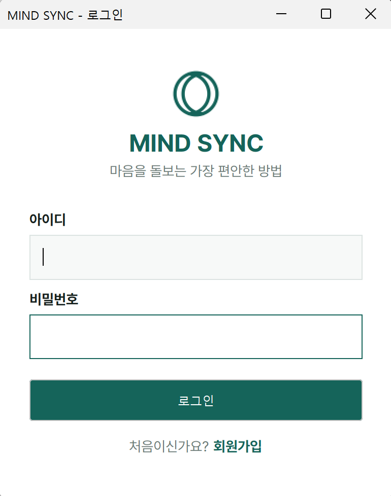
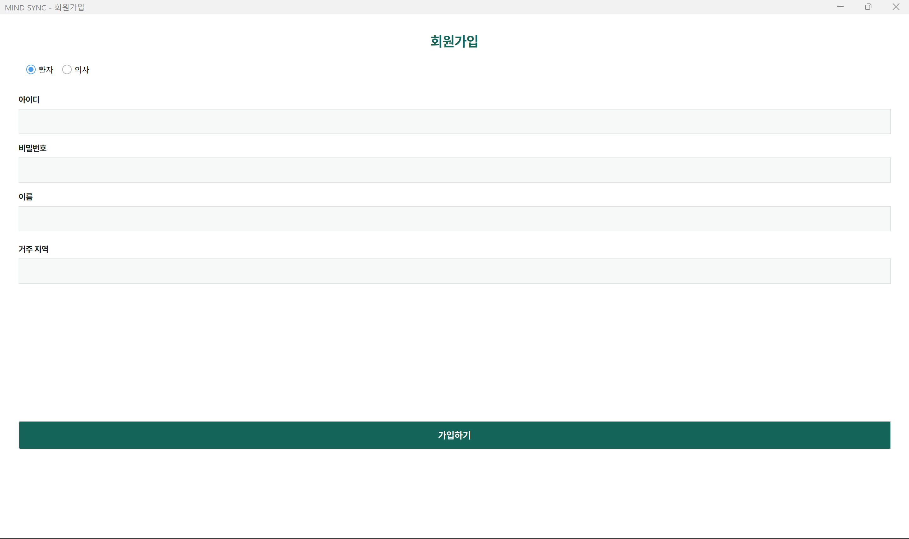
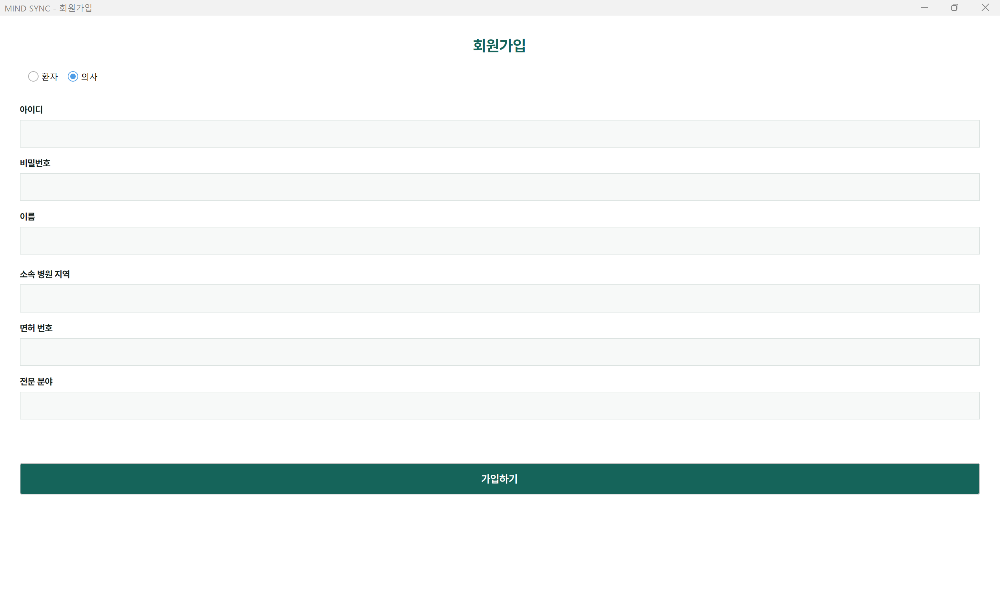
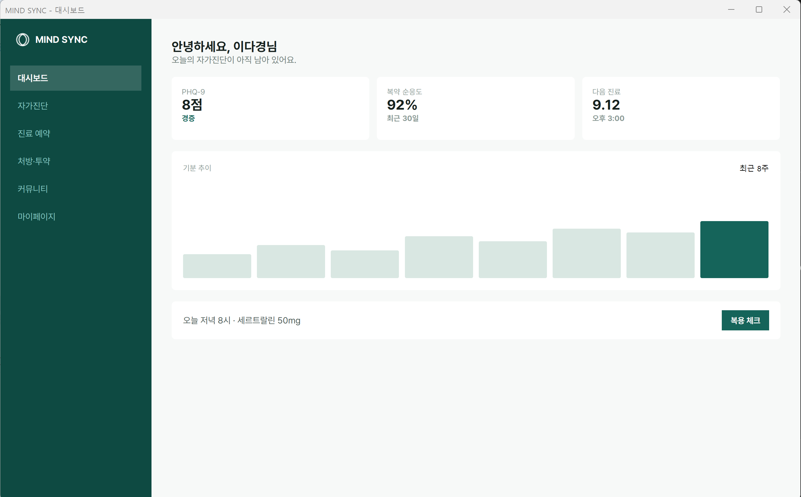

# MIND SYNC

정신건강 관리를 위한 Java 기반 데스크톱 애플리케이션입니다. 자가진단부터 비대면 진료, 처방·투약 기록, 커뮤니티까지 정신건강 관리의 전 과정을 하나의 프로그램에서 지원합니다.

## 소개

정신건강 문제는 초기에 발견하기 어렵고, 가족 환경이나 사회적 인식으로 인해 병원 방문 자체가 지연되거나 거부되는 경우가 많습니다. MIND SYNC는 이러한 진입장벽을 낮추기 위해, 검증된 자가진단부터 비대면 진료·처방, 투약 관리, 정서적 지지(커뮤니티)까지 이어지는 흐름을 하나의 프로그램으로 제공합니다.

## 주요 기능

- **자가진단**: PHQ-9(우울 선별), GAD-7(불안 선별) 등 검증된 척도를 기반으로 자가진단을 실시하고 점수·해석을 제공합니다.
- **비대면 진료**: 진료를 요청하면 환자의 거주 지역을 기준으로 의사가 자동 배정되며, 진료 상태(요청/확정/완료)를 추적할 수 있습니다.
- **처방 및 투약 기록**: 의사가 처방을 등록하면, 환자는 처방받은 약의 복약 여부를 날짜별로 기록·관리할 수 있습니다.
- **커뮤니티**: 이용자 간 글과 댓글로 경험을 공유하고 위로를 주고받을 수 있습니다 (익명 작성 가능).

## 기술 스택

| 구분 | 내용 |
|---|---|
| 언어 | Java (JDK 17) |
| GUI | Java Swing |
| 데이터베이스 | SQLite (JDBC) |
| 개발 도구 | IntelliJ IDEA |

## 프로젝트 구조

```
mindsync
 ├─ model   # User, Patient, Doctor 등 데이터 모델 (상속 구조 포함)
 ├─ db      # DatabaseManager - SQLite 연결 및 테이블 생성
 ├─ dao     # UserDAO, AppointmentDAO 등 - DB 조회/저장 로직
 ├─ gui     # LoginFrame 등 Swing 화면
 └─ Main.java
```

## 실행 방법

1. JDK 17 이상 설치
2. `lib/` 폴더의 `sqlite-jdbc` jar를 라이브러리로 추가
3. `Main.java` 실행

## 화면 미리보기

### 로그인


### 회원가입 (환자 / 의사)
역할(환자·의사)에 따라 입력 필드가 다르게 나타납니다.

| 환자로 가입 | 의사로 가입 |
|---|---|
|  |  |

### 환자 대시보드
로그인 직후 랜딩 화면. 오늘 해야 할 일(자가진단, 복약)과 최근 상태 추이를 한눈에 확인할 수 있습니다.



*(의사 대시보드 등 나머지 화면 스크린샷은 추후 추가 예정)*

## 개발 기간

2026.08.06 ~ 2026.11.02

## 라이선스

*(필요 시 추가)*
